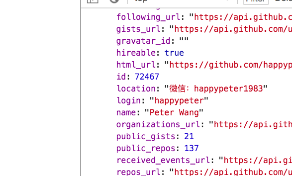

## API 案例：请求 github

来一节案例课程，演练一下之前的 API 概念。

#### 任务：拿到自己的 github 用户名

如果，作为普通用户，采用 UI 的形式，就简单了，直接访问 https://github.com/happypeter 就可以看到，我自己的 github 用户名是 happypeter 。  
但是，如果用 API 的形式，要如何来操作呢？  
API 文档是必须要读的  
首先 API ，这里指的是网络 API ，后面我就都简称 API 了，是后端开发者开发的。所以具体的请求形式，作为前端开发者，我们是不知道的。但是，作为后端开发者，有义务给我们提供一个叫做 API 文档 的东西。例如，我们这里要想拿到 github 上的信息，就要读 https://developer.github.com/v3/ ，也就是 github 的 API 文档。  
然后，就可以找到，请求用户名，需要的 HTTP 请求形式是

```js
GET https://api.github.com/users/happypeter
```

负载数据呢？这个请求不需要。

## 发出 HTTP 请求

我们这里要请求的用户名，例如 happypeter ，这个数据在美国。如果我们自己机器上的数据，可能就是一个普通函数就能拿到。但是，千山万水之外的一个东西，想拿到，就要通过 HTTP 协议来进行通信。我们作为请求方，就要发出 HTTP 请求 。请求的目的地，已经有了，就是 API 文档上读出的 API 接口信息。另外一个要解决的问题，就是用什么工具来发出 HTTP 请求。  
答案就是，用 HTTP 客户端 ，目前用到比较多的有 $.ajax() ，fetch ，axios 。但是最为流行的还是 axios ，所以我们这里也要用 axios 来发这个请求。

## 安装 axios

最专业的方式是用 npm/import 来进行安装导入。这个稍后再说。我们先来一种简单的形式，就是用 `<script>`来导入 axios 。  
首先，我们去网上搜一下 axios cdn 。可以找回 axios 的在线托管版本。

```js
<script src="https://cdn.bootcss.com/axios/0.18.0/axios.js"></script>
从 http://www.bootcdn.cn/axios/ 拷贝 script 标签。
//index.html

<html>

<head>
  <script src="https://cdn.bootcss.com/axios/0.18.0/axios.js"></script>
</head>

<body>

</body>

</html>
```

创建 index.html ，里面把拷贝到的内容，粘贴到 head 标签中，这样，页面打开的时候，浏览器会自动下载，并且运行 axios ，也就相当于 axios 已经安装完毕。

## 用 axios 发请求

自己的 js 可以写到 html 页面中的 script 标签内，同时把这个标签紧贴 </body> 。  
我们要发的请求方法是 GET ，要用的接口就是 axios.get() 。所以，这里 get() 就是一个 axios 的 API ，也就是之前我们提到的 普通 API 。但是，这个 API ，巧合就是用来发 HTTP 请求，请求 网络 API 的。

```js
<script>
  axios.get('https://api.github.com/users/happypeter').then( res =>{' '}
  {console.log('My username:', res.data)}
  )
</script>
```

浏览器中，打开 html ，就可以看到浏览器中端中，显示出了 Github 提供的信息了，其中就包括 login 用户名这一项。


