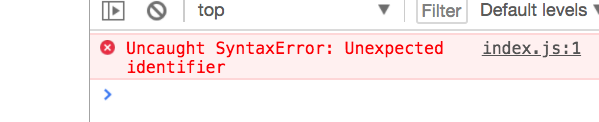

# 用 Webpack 进行项目构建

前面我们用了一个 JS 库，叫 axios ，但是是通过 script 标签的形式导入的。但是其实 axios 最专业方式是通过 import ，作为 ES6 模块来导入。本小节，来聊聊 ES6 模块的打包。

## 什么是 ES6 模块？

##### myModule.js

```js
const myString = 'Hello'
export default myString
```

这里一个模块，就是指一个文件，文件内部的所有变量，对其他文件是不可用的。一个 ES6 模块，就是一个用 ES6 语法进行了导出的 JS 代码文件。只有被导出的变量，才可以被其他文件导入后使用。  
这里，我们定义了一个变量叫 myString 。然后对他进行了 默认导出 （ ES6 还有另外一种导出方式，叫做命名导出，但是具体到打包步骤，都是一样的，所以本文档中，我们都采用默认导出的方式来讲解）。

##### index.js

```js
import myString from './myModule'

console.log(myString)
```

这样，在另外一个文件中，就可以进行导入 （ import 就是导入的意思）。然后使用了。但是有一个很大的问题就是 import 是 ES6 的语法，浏览器是不支持的。

##### index.html

```js
<html>
  <head>
    <script src="./index.js" />
  </head>

  <body />
</html>
```

上面的代码，完全符合 ES6 的规范，但是浏览器中打开 index.html ，会出现报错


报错：未能捕捉到的语法错误：不能识别的标识符。  
很明显，这里指的是 import 这样的语法，浏览器是不认的。  
传统上，一个大项目拆分成多个文件，都是通过 script 标签的形式直接导入到 index.html 。但是这种方式，目前已经过时。所有的正规项目都是用 ES6 模块的方式来导入的。但是如何解决浏览器不支持 ES6 模块的问题呢？

### Webpack 打包 ES6 模块

使用 Webpack 可以把多个 ES6 打包成一个 JS 文件，这样浏览器就可以直接执行了。

```js
npm init -y
```

运行命令，生成一个 package.json 文件。方便后续安装 npm 包。

```js
npm i -D webpack webpack-cli
```

然后，就可以安装 [webpack](https://www.webpackjs.com/) 了。 Webpack 是一个 JS 模块打包器。可以把 ES6 或者 commonjs 格式的模块都打包成一个文件。但是实际上，除了打包，Webpack 还能干几千件事情，而且很难归类，总体上这些事情都跟项目的 构建 （ build ）有关，所以， Webapck 被叫做一个 构建工具 更为合适。但是本文中，我们就先用一下它打包 ES6 模块的能力。

##### webpack.config.js

```js
const path = require('path')

module.exports = {
  entry: './src/index.js',
  output: {
    path: path.resolve(__dirname, 'dist'),
    filename: 'bundle.js'
  }
}
```

Webpack 这个工具一旦运行，就会自动加载 webpack.config.js 中的内容，并且按照里面的内容，对项目进行各种构建操作。稍微解释一下上面的语法：  
require 是导入 commonjs 模块的方式。这里导入了 path 也就是路径处理的功能。  
module.exports 是 commonjs 模块格式，导出一个模块的语句。相当于 ES6 模块下使用 export default 。  
entry 是输入文件，这里指定的是 src 文件夹下的 index.js ，这个是整个程序的入口，里面会 import 其他 js 模块。  
output 用来指定输出文件的位置，\_\_dirname 代码当前文件夹。这里指定的位置是 dist/bundle.js 。

##### package.json

```js
 "scripts": {
    "build": "webpack"
  },
```

到 package.json 文件中，添加一个 npm 脚本 ，脚本名叫 build ，执行这个脚本，实际运行的命令是 webpack 。虽然我们系统上没有 webpack 命令，但是已经在项目内安装了 webpack ，所以是可以在 package.json 中直接使用的。

```js
npm run build
```

命令行中，执行 build 这个脚本，就要用 npm run build 这样的命令。这样实际底层，执行的就是 webpack 命令。会看到这样的报错：

```js
ERROR in Entry module not found: Error:
Can't resolve './src/index.js' in
'/Users/peter/Desktop/es6-module-demo'
```

错误：入口模块未找到。找不到 `./src/index.js`。  
解决方法就是把 js 文件都移动到 src 文件夹下。再次运行 npm run build 会看到一个警告

```js
WARNING in configurationThe 'mode' option has not been set
```

配置文件中，缺少 mode 设置

##### webpack.config.js

```js
mode: 'development'
```

这样，编译输出的内容会存储到 dist/bundle.js 文件中。

##### index.html

```js
<script src="./dist/bundle.js" />
```

到 index.html 改一下路径，指向 bundle.js 。把原来导入 index.js 的那一行删掉。然后浏览器中打开，就可以在终端中看到运行效果了。
bundle.js 中的内容，其实就是 index.js 和 myModule.js 内容之和。或者说 bundle.js 是源文件( src/ 中的文件) 的编译输出。也可以说，src/ 下的所有内容，都被打包成了一个 bundle.js 文件。在当代 Web 开发的环境下，手写的源代码，几乎一定不会被浏览器之间运行，而是把编译输出去交给浏览器运行。
